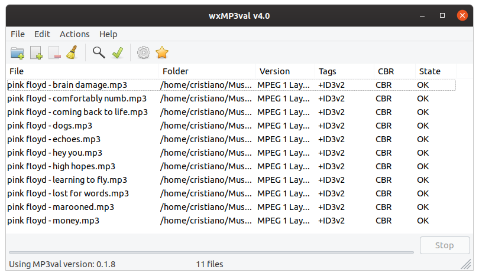

# Modified version of https://github.com/cfgnunes/wxmp3val 
Head over to https://github.com/toluschr/wxmp3val/projects to see which modifications are planned

# wxMP3val

wxMP3val is a free front-end for the [MP3val](http://mp3val.sourceforge.net).



## Getting Started

### Install from sources

Alternatively to downloading the pre-compiled binaries, you can build the application using the source code.

#### Linux

This section assumes you are using Ubuntu 20.04 (Focal Fossa), but the procedure is similar for other Linux distributions.

The prerequisites to build the source is to install the following packages:

```sh
sudo apt -y install build-essential cmake mp3val
sudo apt -y install libwxgtk3.0-gtk3-dev
```

For old Linux distributions, the package `libwxgtk3.0-dev` (instead of `libwxgtk3.0-gtk3-dev`) needs to be installed.

Compile the sources and install the binaries, entering the following commands in the terminal:

```sh
mkdir build
cd build
cmake ..
cmake --build .
sudo make install
```

#### Windows

This section assumes Windows 10, but the procedure is similar for other Windows versions. The prerequisites to build the source is to install the following dependencies:

- [MinGW-W64 GCC-8.1.0](https://sourceforge.net/projects/mingw-w64/files/Toolchains%20targetting%20Win32/Personal%20Builds/mingw-builds/8.1.0/threads-posix/sjlj/i686-8.1.0-release-posix-sjlj-rt_v6-rev0.7z) - i686-posix-sjlj
- [wxWidgets 3.1.3](https://github.com/wxWidgets/wxWidgets/releases/download/v3.1.3/wxWidgets-3.1.3-headers.7z) - header files ('include' folder)
- [wxWidgets 3.1.3](https://github.com/wxWidgets/wxWidgets/releases/download/v3.1.3/wxMSW-3.1.3_gcc810_Dev.7z) - development files for MinGW GCC 8.1.0 ('lib' folder)
- [Gettext](https://mlocati.github.io/articles/gettext-iconv-windows.html) - 32 bit, static
- [CMake](https://cmake.org/download/)

Compile the sources and install with following commands in the terminal:

```sh
mkdir build
cd build
cmake -G "MinGW Makefiles" -DCMAKE_INSTALL_PREFIX:PATH=dist ..
cmake -G "MinGW Makefiles" -DCMAKE_INSTALL_PREFIX:PATH=dist ..
cmake --build . --tar
```

To create an installer on Windows, which is optional, the [Inno Setup](http://www.jrsoftware.org/isinfo.php) must to be downloaded and installed.
To generate the installer setup, use file `installer.iss` in the Inno Setup after build the binaries.

## License

This program is licensed under the terms of the GNU General Public License version 3. Available online under:
<https://www.gnu.org/licenses/gpl-3.0.html>
